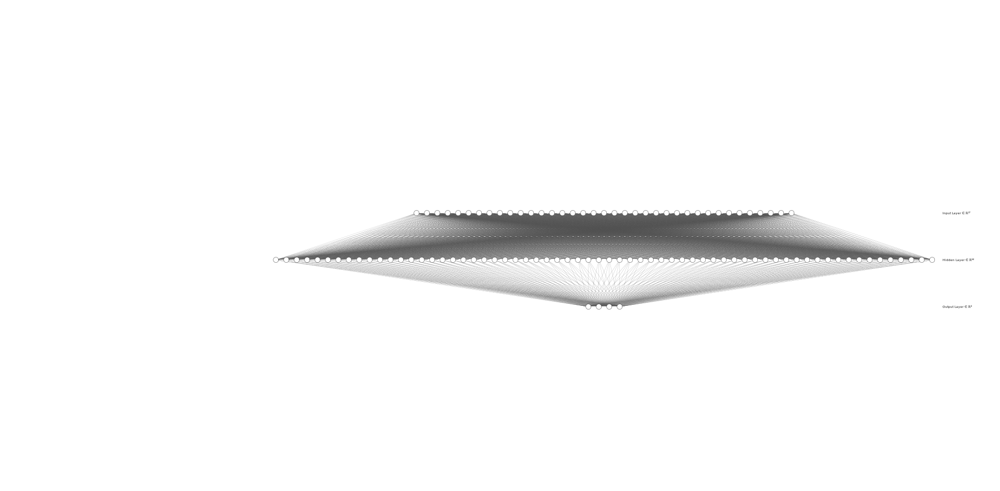

#DQN Implementation

1. Files contained are:
     * Model 
     * Agent
     * Replay Buffer

##Model

##Agent
1. The agent has the following methods:
    * act which will return the action following the current policy of the q network with 1-epsilon probability
    * learn by computing the loss between the local q-network and target q-network and calculate the loss which is 
      propagated back to the local q-network
    * soft update to update the target network with values from the local q-network
##Replay Buffer
Contains a history of interactions of the agen in the environment.